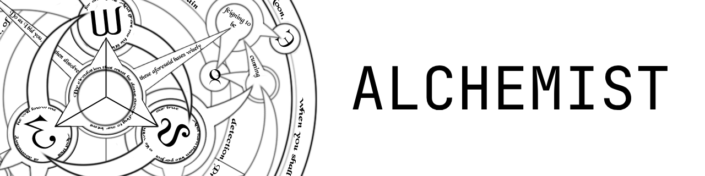

# alchemist

## What is Alchemist?

Alchemist is a new approach on unit testing in Rust, it takes the ideologoy of [Hypothesis](https://hypothesis.readthedocs.io/en/latest/) a libary built for python to supply test data dynamically. Alchemist is a proc-macro based library that generates random test cases each time you run your tests, which then get fed into the test N-amount of times—where N is a configurable argument. Alchemist is licensed under the MIT License.

## Goals

Traditional unit tests check specific, specifically chosen inputs—this can cause edge cases to slip through. Alchemist aims to move away from manual testing and test cases. E.g., from "does this work for my examples?" to "does this work for all valid inputs?" Using generative test data, we can identify bugs that were originally missed.

1. **Catch edge cases early**: Find off-by-one errors, overflow conditions, and boundary failures before a production incident.
2. **Reduce test maintenance**: One macro can remove dozens of hand-written cases
3. **Improve confidence**: Keep peace of mind by knowing your code will work with every input.
4. **Clear failure reporting**: When tests fail, see exactly which generated values caused the problem
5. **No boilerplate**: A single attribute macro handles generation, iteration, and error reporting 

## Status

Alchemist is **brand-new**, which means it is not ready for production usage and will likely have bugs we haven't caught yet. That said, it has a usable API with basic test generation capabilities. See [`/tests`](tests/) for examples.

History of Alchemist below:

- Started work on Janurary 2026.
- Added custom generator support with path and generic type handling.
    - The `Value` trait now requires `Debug`. Types implementing `Value` must also implement `Debug` (e.g., `#[derive(Debug)]`).

## Documentation / User Guides

All documentation can be found in our Github Repo at [`/docs`](docs/)
