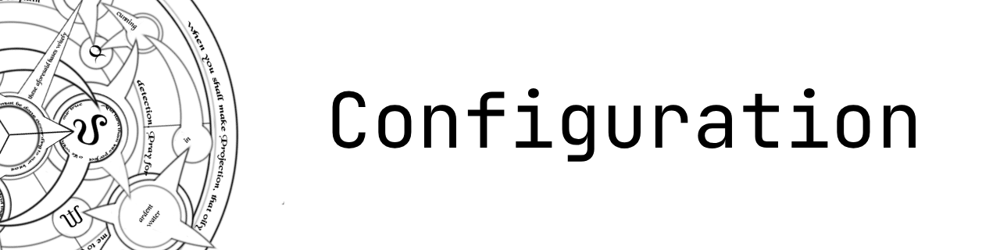

# Alchemist - Configuration



Alchemist currently has one configuration option: the number of test iterations.

## Iterations

By default, each test runs 100 iterations. You can override this with the `iterations` parameter:

```rust
#[alchemist(int, int, iterations = 500)]
fn test_addition(x: i32, y: i32) {
    assert!(x + y == y + x);
}
```

The iteration count can be set to any positive integer. Higher values increase the chance of finding edge cases but take longer to run.
